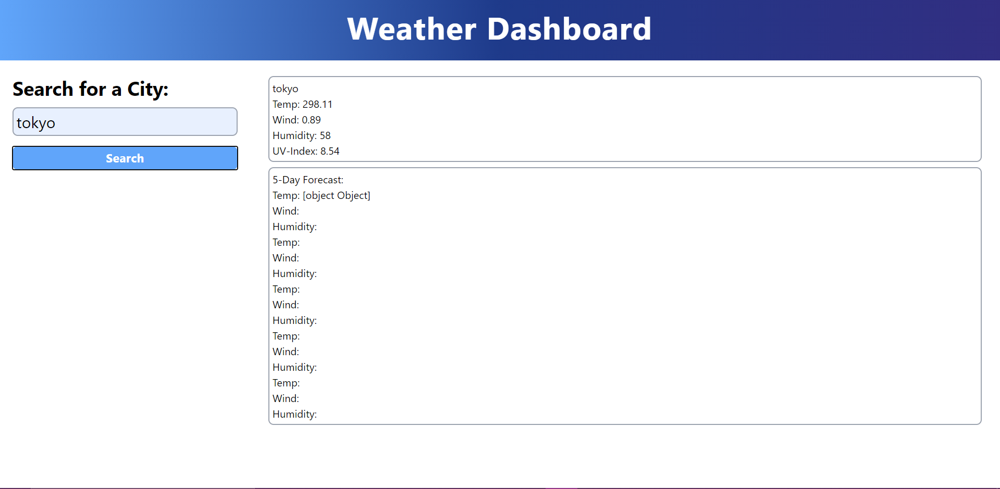

# Weather Dashboard

## Purpose
Create a weather dashboard that implements server-side apis (OpenWeather One Call API).

## Built With
* HTML
* CSS/Bootstrap
* Javascript

## Website
https://rwyland189.github.io/weather-dashboard/

## Screenshot

## Contribution
Made by Becca Wyland